# Patent Semantic Search System

A production-ready Patent Retrieval & Semantic Search system built with **Python**, **Qdrant Vector DB**, the **Qwen3 Embedding Model**, an **LLM-based Query Understanding layer**, **metadata filtering**, a **cross-encoder reranker**, and an **Answer Evidence Extraction & Highlighting engine**.

The pipeline handles end-to-end processing of complex technical patent documents: from raw document parsing and multi-stage semantic chunking, through validation, vector embedding, and batch indexing — to natural-language query understanding, answer-target-preserving semantic retrieval for questions, patent-grouped vector search, post-retrieval metadata filtering, cross-encoder reranking, evidence selection, and patent-level result aggregation. A Streamlit UI and CLI tools are included for search and index inspection.

---

## 📐 System Architecture & Flow

```mermaid
flowchart TD
    subgraph Ingestion_Pipeline ["1. Ingestion & Indexing Pipeline"]
        A["Raw Patent Files (.txt + .json)"] --> B["Patent Parser (app/parser.py)"]
        B --> C["Patent Document Object"]
        C --> D["Section Detector (app/chunking/section_detector.py)"]
        D --> E["Semantic Unit Splitter (app/chunking/semantic_unit_splitter.py)"]
        E --> F["Token-Aware Chunk Builder (app/chunking/chunk_builder.py)"]
        F --> G["Chunk Validator (app/chunking/chunk_validator.py)"]
        G --> H["Embedding Engine (Qwen3-Embedding-0.6B)"]
        H --> I1["patent_chunks collection (vectors + chunk payload)"]
        C --> I2["patents collection (metadata only, no vectors)"]
    end

    subgraph Search_Pipeline ["2. Query Understanding & Search Pipeline"]
        J["User Search Query"] --> K["Query Understanding LLM (app/query_understanding/)"]
        K --> K1["ParsedQuery: semantic_query + metadata_filters +\nis_question + question_intent + dynamic requirements"]
        
        K1 -->|"is_metadata_only: filters, no topic"| MO1["Filter whole patents collection\n(QdrantDB.filter_patent_ids)"]
        MO1 --> MO2["Fetch every chunk of matching patents\n(QdrantDB.get_chunks_for_patent_ids) - unbounded, no rerank"]
        MO2 --> P
        
        K1 -->|"Topic Query (is_question=false)"| L1["semantic_query = core topic\n(e.g., 'material property determination')"]
        K1 -->|"Question Query (is_question=true)"| L2["semantic_query = answer-target-preserving retrieval query\n(e.g., 'properties determined based on identified material')"]
        
        L1 --> L["Embed semantic_query ONLY (app/embedder.py)"]
        L2 --> L
        
        L --> M["Qdrant group-by-patent_id search on patent_chunks\n(top PATENT_CANDIDATE_TOP_K patents - identifies WHICH\npatents are candidates, not which of their chunks matter)"]
        M --> M1["Dedup to 1 best chunk/patent for display only\n(_dedupe_top_chunk_per_patent -> qdrant_results)"]
        M --> N{"metadata_filters present?"}
        N -->|"yes"| N1["FilterEngine.matches() per candidate patent_id\n(metadata lookup only, before any chunk text is fetched)"]
        N -->|"no"| F1
        N1 --> F1["Fetch EVERY indexed chunk of each surviving\ncandidate patent (QdrantDB.get_chunks_for_patent_ids -\nunbounded, not just the handful vector search surfaced)"]
        F1 --> RV["Relevance Verification (app/relevance_verifier.py)\nA candidate must literally name the query's concept\n(ParsedQuery.required_phrases) in its title, abstract,\nor the chunks vector search matched - no model call.\nRejected patents never reach the reranker below"]
        RV --> O["Cross-Encoder Reranker (remote or local, app/reranker.py)\nScores EVERY chunk of every surviving patent individually;\na patent's score = MAX across its own chunks -\nno hand-tuned weights, no combined-text blob"]
        O --> O1["Exclusion hard-filter: drop a patent only if its OWN\nwinning (highest-scoring) chunk names an excluded term"]
        O1 --> O2["Rank by score (VERIFIED_RELEVANCE_THRESHOLD = 0.0:\nthe gate decides membership, the score only orders;\nPATENT_RELEVANCE_THRESHOLD applies only when\nverification could not run)"]
        O2 --> FB{"nothing matched?"}
        FB -->|"yes, and broadening is honest"| FB1["Broader Search (app/relevance_verifier.py verify_broader)\nSame chunks, relaxed wording (fallback_phrases),\naccepted in the patent's TITLE only - labelled BROADER,\nnever mixed into exact matches"]
        FB -->|"no"| ES
        FB1 --> ES

        ES{"is_question?"}

        ES -->|"yes"| ES1["Evidence Selector & Answer Extractor (app/evidence_selector.py)\nExtracts answer, verbatim evidence, confidence, and character spans"]
        ES -->|"no"| P["Patent Aggregation (app/semantic_search.py)"]
        ES1 --> P
        
        P --> Q["PatentSearchResult list, top FINAL_TOP_K\n(question queries: a patent with a genuine\nanswer leads, otherwise sorted by relevance score)"]
        Q --> R["Streamlit UI (app/ui/search_app.py) / CLI"]
    end
```



---

## ⚙️ End-to-End Process Breakdown

### Stage 1: Patent Data Reading & Parsing (`app/parser.py`)
* **Input Data Structure**:
  * Raw Patent Text (`.txt`): Contains full patent text with section headers (Abstract, Background, Detailed Description, Claims).
  * Patent Metadata (`.json`): Contains structured metadata like Patent ID, Title, Filing Date, Classification codes, Assignee/Applicant, and Inventors.
* **Process**:
  1. `PatentParser.load_patent(txt_path)` reads both text and corresponding `.json` metadata side-by-side.
  2. Constructs a unified `PatentDocument` dataclass containing `patent_id`, `text`, and `metadata`.

---

### Stage 2: Section Detection & Semantic Chunking (`app/chunker.py` + `app/chunking/*`)
Patents require strict structural isolation — chunks must never mix contents across document sections.

* **Step 2.1 - Section Detector (`section_detector.py`)**:
  * Scans document text line-by-line using heading heuristics (all-caps line, colon-terminated titles, short line length bounds).
  * Identifies standard patent sections (e.g., `ABSTRACT`, `BACKGROUND OF THE INVENTION`, `SUMMARY`, `DETAILED DESCRIPTION`, `CLAIMS`).
  * Yields isolated `Section` objects. Each section is processed as an independent stream.

* **Step 2.2 - Hierarchical Semantic Unit Splitter (`semantic_unit_splitter.py`)**:
  * Splits section content hierarchically: **Paragraphs → Sentences → Word Fragments**.
  * Measures precise token lengths using `TokenCounter` backed by the HuggingFace `Qwen3-Embedding` tokenizer with an LRU cache (`TOKEN_COUNT_CACHE_SIZE = 4096`).

* **Step 2.3 - Token-Aware Chunk Builder (`chunk_builder.py`)**:
  * Merges semantic units greedily until reaching `MAX_CHUNK_TOKENS` (default: 512 tokens).
  * Section boundaries are strictly enforced — no chunk spans multiple sections.

---

### Stage 3: Chunk Quality Validation & Filtering (`app/chunking/chunk_validator.py`)
To prevent indexing low-quality vector noise into Qdrant, every chunk passes through rigorous validation rules:

1. **Whitespace Normalization**: Collapses redundant tabs, double spaces, and newline padding.
2. **Heading-Only Rejection**: Filters out isolated headings without body content (e.g., `DETAILED DESCRIPTION OF PREFERRED EMBODIMENTS`).
3. **Low-Information Filtering**: Calculates the ratio of alphabetic characters to total characters. Rejects chunks falling below `VALIDATOR_LOW_INFO_THRESHOLD` (0.30) to eliminate table artifacts, binary noise, and separator lines.
4. **Degenerate Overlap Loop Prevention**: Tracks unique token ratios against previous chunks to reject near-duplicate chunks.

---

### Stage 4: Vector Embedding Generation (`app/embedder.py`)
* **Model**: `Qwen/Qwen3-Embedding-0.6B` via `sentence-transformers`.
* **Output Dimension**: 1024-dimensional dense vectors (`VECTOR_SIZE = 1024`).
* **Normalization**: L2 normalization (`normalize_embeddings=True`) applied to all chunk and query vectors for accurate cosine similarity calculation.
* **Process**: Each validated `PatentChunk` is passed to `Embedder.embed()`, populating its `.vector` attribute.

---

### Stage 5: Vector DB Indexing & Storage (`app/qdrant_db.py` & `app/ingest.py`)
* **Vector Store**: **Qdrant** running via Docker on port `6333`.
* **Two Collections**:
  * `patent_chunks` — one point per chunk, with its embedding vector and full chunk payload. Searched.
  * `patents` — one point per patent, metadata only, no vectors. Looked up by `patent_id` for display and metadata filtering; never searched by vector.
* **Distance Metric**: Cosine Similarity.
* **Batch Ingestion**:
  * `app/ingest.py` calls `QdrantDB.create_collections()` on startup (idempotent — no-ops if they already exist), so a fresh Qdrant instance gets both collections created automatically on first run; no manual setup step is required.
  * It then orchestrates ingestion of patent files from `PATENT_DIRECTORY` (`app/config.py`, currently `"television"`).
  * Accumulates embedded chunks in batches of `BATCH_SIZE = 100` and upserts via `QdrantDB.insert_batch()`.
  * Upserts patent metadata once per patent, buffered `METADATA_BATCH_SIZE` at a time via `QdrantDB.upsert_patent_metadata_batch()`.
* **Ingestion Throughput**: the stage order is parse → metadata → chunk → embed → insert, but the work is scheduled to keep the embedding model busy, since embedding dominates total ingest time:
  * Each patent's chunks are embedded in **one batched forward pass** (`Embedder.embed_batch`, `EMBED_BATCH_SIZE` chunks per pass) rather than one `model.encode()` call per chunk.
  * A prefetch thread parses and chunks up to `INGEST_PREFETCH` patents ahead, so file I/O and tokenization overlap with embedding instead of alternating with it.
  * Mid-run chunk/metadata upserts are sent with `wait=False` so Qdrant indexes one batch while the next is being embedded; the final flush uses `wait=True`, so the completion totals reflect committed data.
* **Per-Patent Progress**: two lines per patent bracket the expensive stage.
  * `<patent_id> | split into N chunks - embedding` prints as soon as chunking finishes, so a patent about to occupy the embedder for hours announces its size up front.
  * `<patent_id> | embedded N chunks | inserted N chunks` prints *after* the Qdrant write, so a patent is only announced as inserted once its chunks are actually stored.
  * A running summary (patents, chunks, failures, elapsed, patents/sec) prints every 500 patents.
* **Progress Display** (`rich.progress`, built in `_build_progress()`): two bars — `Indexing Patents` and `Embedding Chunks` — each with spinner, percentage, count, throughput, elapsed and ETA.
  * The patent bar advances only when a patent is **fully finished** (in a `finally`, so failures still count). Advancing on dequeue would show a patent as done before any of its chunks were embedded — badly misleading with a prefetch queue, and outright useless for a single-file run.
  * The chunk bar's total is not knowable up front, so it starts indeterminate and grows as each patent reports what it split into. `Embedder.embed_batch(..., on_progress=...)` advances it after every batch, which is the only movement visible while one very large patent is embedding.
  * Per-patent lines are printed with `progress.console.print(...)`, which Rich renders *above* the live bar without corrupting it. `markup=False, highlight=False` keeps a patent ID or an exception message containing square brackets from being parsed as Rich markup.
  * Rich detects a redirected stdout on its own and skips the live redraw, so an ingest piped to a log file stays readable instead of collecting thousands of control characters.
  * `RateColumn` is a small custom column — Rich ships speed columns for byte transfers, not items. It shows `N/s` at or above 1/s and inverts to `Ns each` below it, which is the range this pipeline actually runs in.
* **Multilingual Chunking** (`app/chunking/semantic_unit_splitter.py`): the corpus spans English, French, Spanish, German, Chinese, Japanese and Korean, which a Latin-only splitter cannot handle.
  * **CJK terminators**: Chinese and Japanese end sentences with `。！？｡` and write *no space* afterwards, so a rule of "`[.!?]` followed by whitespace" finds **zero** boundaries in them. The boundary regex has a separate CJK branch that splits immediately after the terminator. French, Spanish, German and Korean all use `[.!?]` plus spaces and take the Latin path unchanged.
  * **Character-level fallback**: Chinese and Japanese do not delimit words with spaces, so `str.split()` can return a single "word" of unbounded length — previously emitted as one oversized chunk. Every fallback now bottoms out in `_split_by_characters()`, the only split guaranteed to make progress on a script with no whitespace. It sizes each slice from the text's own observed characters-per-token ratio, so it adapts per script instead of assuming one.
  * **Boundaries are matched, not consumed**: sentences are cut with `finditer` on `match.end()` rather than `re.split()`, so a terminator and any closing quote or bracket (`."` / `。」`) stay attached to the sentence they end instead of being dropped from the text.
  * **Abbreviation screening now actually fires**: the negative lookbehinds sit immediately before the terminator, where they see `Dr` and `Fig`. Anchored *after* the dot — as they were — they inspected `r.` and `g.` and never matched, so `Dr. Smith`, `Sr. García` and `Nr. 5` were all being split mid-abbreviation.
  * **Guarantee**: every unit returned is at most `MAX_CHUNK_TOKENS`. Word packing budgets with per-word estimates, so each fragment is re-measured on its joined text and re-split if the estimate came up short.
  * **Oversized-paragraph screen**: a paragraph longer than `max_tokens * CERTAINLY_OVERSIZED_CHARS_PER_TOKEN` is treated as oversized without being tokenized. Tokenizing a multi-megabyte paragraph only to learn it is too big cost far more than the split it triggers.

* **Chunk Payload Attributes**:
  * `patent_id`, `section`, `text`, `chunk_id`, `section_chunk_index`, `document_chunk_index`, `total_chunks`, `token_count`, `word_count`.

---

### Stage 6: Query Understanding & Question Processing (`app/query_understanding/`)
Before anything is embedded, the raw natural-language query is processed by the Query Understanding LLM (remote endpoint with local fallback). It classifies the query type and extracts structured representations into a `ParsedQuery`:

1. **Query Intent Classification (`is_question`)**:
   * **Topic Search (`is_question = false`)**: User wants to find patents about a topic or technology (e.g., *"material-aware 3D scanning"*, *"methods for determining material properties"*).
   * **Question / Answer-Seeking Query (`is_question = true`)**: User seeks specific factual information from patent text (e.g., *"What types of image capture devices can be used in the system?"*, *"How is material determined based on detected features?"*).

2. **Adaptive Semantic Query Generation (`semantic_query`)**:
   * **Rule 4A (Topic Search)**: Strips recognized metadata filter phrases and outputs the clean invention/technology topic.
   * **Rule 4B (Question Search)**: Generates an answer-target-preserving retrieval query:
     $$\text{semantic\_query} = \text{requested\_answer\_target} + \text{target\_entity} + \text{important\_relationship}$$
     * Preserves the exact answer target (*types of devices*, *properties*, *methods*, *reasons*, *components*, *differences*) and qualifying context (*used in the system*, *based on detected features*).
     * Prevents over-summarization (does **not** reduce *"What types of image capture devices can be used in the system?"* to *"image capture devices"* or *"image capture system"*).
     * Avoids over-expansion and hallucinated keyword dumps.

3. **Metadata Filters (`metadata_filters`)**:
   * Extracts structured `(field, operator, value)` constraints mapped strictly to the allowlist (e.g. `CAN_EN`, `AAPS`, `PY`, `PRC`). Filters are preserved separately from `semantic_query` even in question queries.

4. **Dynamic Requirements Structure & Question Intent**:
   * For topic searches: extracts `concepts`, `goals`, `constraints`, `optimization`, `exclusions`, and `relationships`. Only `exclusions` feeds the reranker (its hard-filter, see Stage 9) - the rest are used to highlight matched query terms in the displayed result text (`app/evidence_selector.py`).
   * For questions: populates `question_intent` with `target`, `expected_answer_type`, and `answer_criteria`.

---

### Stage 6B: Metadata-Only Fast Path (`SemanticSearch._search_by_metadata_only`)
Taken whenever `parsed.is_metadata_only` is `True` (e.g. *"applications filed in 2008 by Wyeth"*):

1. `QdrantDB.filter_patent_ids()` scrolls the entire `patents` collection and returns every `patent_id` matching all `metadata_filters`.
2. `QdrantDB.get_chunks_for_patent_ids()` fetches every chunk belonging to those patents from `patent_chunks` without vector search or reranking.
3. Chunks slot directly into aggregation with a placeholder score of `10.0` (max of the reranker's 0-10 scale) - a confirmed metadata match, not an actual relevance judgment, since there's no topic text to score against.

---

### Stage 7: Semantic Vector Search (`app/semantic_search.py` + `app/qdrant_db.py`)
1. `Embedder.embed_query(parsed.semantic_query)` embeds the retrieval-optimized `semantic_query`.
2. `QdrantDB.search()` executes a **group-by-`patent_id`** vector search against `patent_chunks`, retrieving the top `PATENT_CANDIDATE_TOP_K` (default: 50) candidate patents, each contributing up to `CANDIDATE_CHUNKS_PER_PATENT` (default: 3) chunks. This step decides **which patents** are candidates (a cheap embedding-similarity signal) - it is NOT the chunk set reranking sees (see Stage 8b).
3. Two internal views are created:
   * `candidate_chunks`: used only to derive the candidate `patent_id` list and the display view below.
   * `qdrant_results`: a deduplicated display-only view (top chunk per patent) for candidate inspection - shown in the UI as "Qdrant Vector Search Candidates". It does not reflect the fuller chunk set reranking actually checks.

---

### Stage 8a: Metadata Filtering, on Candidate Patent IDs (`app/filter_engine.py`)
Runs BEFORE any chunk text is fetched. If `metadata_filters` exist:
* Metadata for the candidate `patent_id`s from Stage 7 is batch-fetched from the `patents` collection.
* `FilterEngine.matches()` checks every metadata constraint against each candidate patent.
* Non-matching patent_ids are dropped - so a patent's full chunk set (Stage 8b) is only ever pulled for patents that already pass this.

---

### Stage 8b: Full Chunk Retrieval (`QdrantDB.get_chunks_for_patent_ids`)
For each surviving candidate patent_id, fetches **every** chunk it has in `patent_chunks` - unbounded, not just the `CANDIDATE_CHUNKS_PER_PATENT` chunks the initial vector search happened to surface. Patents in this corpus range from 1 to over 2,000 chunks, so this is the step that lets reranking judge a patent by its strongest evidence out of everything it discloses, not a similarity-biased subset.

---

### Stage 8c: Relevance Verification (`app/relevance_verifier.py`)
The precision gate, and the answer to *"why did searching for an **LED TV** return an **LCD** TV?"* — placed here, before reranking, so the expensive stage never scores a patent that is going to be thrown out.

A cross-encoder scores how **similar** two texts are. That is not the same question as *"is this the thing I asked for"*, and on patent text the two come apart:

* `CN206212157U`, title *"Multi -functional LCD TV"*, scored **9.3/10** for **"LED TV"** — a liquid crystal television that carries an LED lamp on its case for night lighting. It contains "LED", it contains "TV", **in the same sentences**, so no word-level or proximity rule rejects it. What it never says is *"LED television"*.
* **"car"** returned patents about *vehicles* in general, and a motorcycle.

So the check is on the **compound phrase**, not the query's words:

1. **Where the phrases come from** — `ParsedQuery.required_phrases`, produced by the Query Understanding call that **already runs once per query** (prompt.py RULE 6). This stage makes **no LLM call of its own**. Groups of interchangeable surface forms, one group per essential concept, **all** required:
   * `"LED TV"` → `[["LED TV", "LED television", "light emitting diode television", ...]]`
   * `"car"` → `[["car", "automobile", "passenger car", "sedan", ...]]`
   * A qualifier always stays welded to the thing it qualifies — `["LED"], ["TV"]` as separate groups is exactly the bug.
2. **A deterministic backstop for the group** — the prompt forbids a broader category inside a group, and a sampled run put `"vehicle"` in the group for `"car"` anyway, which silently passes every vehicle patent. So Query Understanding is also asked the question from the other side (`broader_terms`: *what categories does this concept belong to?*) and anything in both answers is struck out before matching. Two guards keep that from backfiring: a phrase the **user typed** is never struck (one run named "car" itself as broader than "car"), and a group emptied by the backstop keeps its original phrases.
3. **Where a phrase has to appear** — a 200-page description mentions everything in passing, so a mention there proves nothing. The primary scope is what the patent says it **is** (title, abstract) plus what made it a candidate (the chunks vector search matched):
   * **MATCH** — every group named in that scope. Kept.
   * **RELATED** — every group named somewhere in the patent, but not in that scope. Dropped unless `VERIFICATION_KEEP_RELATED`.
   * **NO_MATCH** — some group never named at all. Dropped.
4. **Matching is exact but forgiving of spelling** — case, hyphens and whitespace are folded (`"LED-TV"`, `"LED  TV"`, `"led tv"`), a trailing plural is tolerated, and boundaries use `[0-9a-z]` lookarounds rather than `\b` so `"car"` never matches inside *"carriage"* while a CJK phrase still matches between CJK characters.
5. **What it costs, and what it saves** — string matching over the candidate set, a few hundred milliseconds; against that, the reranker only ever sees the survivors. For **"LED TV"** that is **0 chunks scored instead of 2342**, and the whole query drops from ~18.6 s to ~3.8 s.
6. **It degrades, never swallows.** If the stage cannot run — disabled, or no phrases from Query Understanding (an LLM outage leaves them empty) — it reports `ran=False`, returns its input untouched, and the stricter `PATENT_RELEVANCE_THRESHOLD` decides exactly as before.

7. **When nothing matches at all** — a strict compound phrase is right for `"LED TV"` but wrong for `"water container"`: nothing in this corpus is *described* as a water container, though it is full of bottles. So Query Understanding also supplies `fallback_phrases` (the concept with its qualifier dropped), used **only** when the exact wording matched nothing, and accepted **only in the patent's title** — what it says it *is*. Those results are labelled `BROADER` and never mixed into exact matches. Crucially, the LLM leaves `fallback_phrases` **empty** when broadening would name a different product: `"LED TV"` relaxed to `"television"` returns the LCD sets this stage exists to reject, so that query still honestly returns nothing.

Every verdict, kept or dropped, is shown with its reason in the UI's **Relevance Verification** panel and in the CLI diagnostics — a rejected patent leaves no other trace, so without that panel a query whose top hit was thrown out would look identical to a query that found nothing. A patent the gate kept that a later stage dropped records its score and says so.

---

### Stage 9: Cross-Encoder Reranking (`app/reranker.py`)
Scores every candidate **chunk individually**, then assigns each patent the MAX of its own chunks' scores.

> **The chunk text is sent bare.** It used to be prefixed with `Section: <name>\n` for structural context. Measured against the live model that prefix was catastrophic for short chunks — a title is often four words, so the boilerplate was most of what the cross-encoder saw: `"car"` vs the title **"Automobile"** scored **3.0/10 with the prefix, 10.0/10 without**; `"bottle"` vs **"Bottle"** went **4.3 → 10.0**. On long chunks it changed almost nothing. Removing it made the patent titled *Automobile* the top result for *car*, where it belongs.

1. Every chunk fetched in Stage 8b is scored against `semantic_query` in **one batched cross-encoder call** (remote reranking server with local `CrossEncoder` fallback), producing a **0-10 relevance score** per chunk.
2. A patent's score is the **MAX** across all of its own chunks' scores - it's judged by its single strongest disclosed passage, not an average, not a top-K cut, and not a combined-text blob (a patent can have thousands of chunks, so combining them would exceed any usable model input length). The chunk that earned that max is the patent's best-evidence chunk, stashed on `chunk.payload["_chunk_relevance"]`.
3. **Exclusion hard-filter**: if the query carries exclusion terms (e.g. *"without indium tin oxide"*), a patent is dropped only if its **own winning chunk** - the specific evidence that earned it its score - literally names an excluded term. Only that one chunk is checked, not the patent's whole chunk set: Query Understanding's exclusion extraction is itself an LLM call and can occasionally infer a term the user never asked to exclude, and a long patent will often mention an ordinary, unrelated term like that somewhere irrelevant - checking every chunk would let a hallucinated exclusion wrongly sink an otherwise correct match.
4. **The score ranks; it does not filter.** `VERIFIED_RELEVANCE_THRESHOLD` is `0.0`: once Stage 8c has confirmed a patent literally names what was asked for, the cross-encoder only orders the survivors. That is measured, not a preference — this model rewards literal overlap and punishes synonyms, exactly what the gate accepts: it scores the title *"350ml Water bottle."* **0.0/10** against *"drinking water jerrycan"*. A signal that returns 0.0 for a right answer cannot be a filter at any threshold; every value tried (7.0, 5.0, 3.0) deleted correct answers. `PATENT_RELEVANCE_THRESHOLD` (`7.0`) still applies when Stage 8c could not run, since then nothing else vets topicality.
5. **Exclusions** match on word boundaries, not substrings — excluding `"cap"` used to strike out any chunk containing *"escaping"* or *"capacitor"*.

---

### Stage 10: Answer Evidence Selection & Span Highlighting (`app/evidence_selector.py`)
For question queries (`parsed.is_question = True`), candidate chunks pass through the `EvidenceSelector`:

1. **Answer & Evidence Extraction**:
   * Analyzes top reranked chunks against `parsed.question_intent`.
   * Extracts a concise **answer summary** and verbatim **supporting evidence sentences**.
   * Employs remote LLM extraction with an automated deterministic fallback algorithm based on target directness and core term coverage.
2. **Exact Character Span Resolution**:
   * `locate_span_in_text()` calculates precise character offsets `[start_char, end_char]` inside the original chunk text.
3. **HTML Highlighting**:
   * `highlight_spans()` wraps matched evidence in `<mark>` tags for UI presentation.
4. Attaches `answer`, `answer_evidence`, `answer_span`, `answer_score`, and `highlighted_text` to the chunk payload.

---

### Stage 11: Patent-Level Aggregation (`app/semantic_search.py`)
* `SemanticSearch._aggregate_by_patent()` groups reranked chunks by `patent_id`.
* **Patent Score**: the MAX-of-its-chunks relevance score from Stage 9 (identical across a patent's own chunks, since it's the same max); `best_chunk` is the specific chunk whose own score (`RankedChunk.chunk_relevance_score`) produced that max - the same model that decided relevance also decides which passage to display, not a separate heuristic.
* **Sorting**: question queries put a patent with a genuine extracted answer first, ahead of any patent without one (regardless of relevance score); topic queries sort by relevance score alone.
* Preserves question answers and highlighted evidence in `PatentSearchResult`.
* Results are truncated to `FINAL_TOP_K` (default: 10) patents.

---

## 🛠️ Project Configuration & Tunables (`app/config.py`)

All system thresholds are centrally managed in `app/config.py`:

| Component | Setting | Default Value | Description |
| :--- | :--- | :--- | :--- |
| **Qdrant** | `QDRANT_HOST` / `PORT` | `localhost:6333` | Qdrant vector database connection |
| | `CHUNKS_COLLECTION_NAME` | `"patent_chunks"` | Searchable chunk collection (vectors + payload) |
| | `PATENTS_COLLECTION_NAME` | `"patents"` | Patent metadata collection (no vectors) |
| **Embedding** | `EMBEDDING_MODEL` | `"Qwen/Qwen3-Embedding-0.6B"` | SentenceTransformer embedding model |
| | `VECTOR_SIZE` | `1024` | Vector dimensionality |
| **Chunking** | `MAX_CHUNK_TOKENS` | `512` | Token capacity limit per chunk |
| | `MIN_CHUNK_TOKENS` / `MIN_CHUNK_WORDS` | `20` / `8` | Minimum size for a valid chunk |
| | `BATCH_SIZE` | `100` | Points per Qdrant upload batch |
| **Ingestion** | `EMBED_BATCH_SIZE` | `8` | Chunks per batched embedding forward pass — the main ingest throughput lever |
| | `METADATA_BATCH_SIZE` | `256` | Patent metadata points per Qdrant upload batch |
| | `INGEST_PREFETCH` | `2` | Patents parsed/chunked ahead of the embedder by the prefetch thread |
| **Validator** | `VALIDATOR_LOW_INFO_THRESHOLD` | `0.30` | Minimum ratio of alpha characters required |
| | `VALIDATOR_DEGENERATE_OVERLAP_THRESHOLD` | `0.9` | Minimum unique-content ratio vs. previous chunk |
| **Query Understanding** | `QUERY_LLM_REMOTE_BASE_URL` / `_MODEL` | — | Remote OpenAI-compatible endpoint & model |
| **Reranker** | `RERANKER_REMOTE_BASE_URL` / `_MODEL` | — | Remote reranking server URL & model |
| | `PATENT_CANDIDATE_TOP_K` | `50` | Distinct candidate patents from vector search - each gets EVERY one of its own chunks checked by reranking, so this is the main lever on reranking latency vs. candidate breadth |
| | `CANDIDATE_CHUNKS_PER_PATENT` | `3` | Chunks per candidate patent from the INITIAL vector-search step only (identifying candidates + the display view) - reranking itself checks a patent's complete chunk set, not this |
| | `PATENT_RELEVANCE_THRESHOLD` | `7.0` | 0-10 relevance score (the MAX across a patent's own chunks) a patent must meet to be kept as a match - the only reranking threshold |
| | `FINAL_TOP_K` | `10` | Final reranked patents returned |
| **Relevance Verification** | `VERIFICATION_ENABLED` | `True` | Master switch — `False` restores the plain `PATENT_RELEVANCE_THRESHOLD` cut with no phrase check |
| | `VERIFIED_RELEVANCE_THRESHOLD` | `0.0` | Relevance cut for patents that PASSED verification. Zero because the gate decides membership and the score only ranks — raise it only if genuinely off-topic patents appear, and fix the gate first if they do |
| | `BROADER_RELEVANCE_THRESHOLD` | `0.0` | The same for the broader fallback tier, which is kept honest by its title-only rule rather than by a score |
| | `VERIFICATION_FALLBACK_ENABLED` | `True` | Search again with relaxed wording when the exact wording matched nothing, labelled as broader matches. `False` returns an honest empty page instead |
| | `VERIFICATION_KEEP_RELATED` | `False` | Keep patents that name the concept only in passing, ranked below confirmed matches |
| **UI** | `PATENT_VIEW_URL_TEMPLATE` | — | External patent detail page URL template |

---

## 📁 Repository Directory Structure

```
rag_demo/
├── app/
│   ├── chunking/                       # Token-aware chunking subsystem
│   │   ├── chunk_builder.py            # Greedily constructs token-bounded chunks
│   │   ├── chunk_validator.py          # Quality and duplicate filtering
│   │   ├── section_detector.py         # Heading & patent section boundary detection
│   │   ├── semantic_unit_splitter.py   # Paragraph/sentence semantic unit splitter
│   │   └── token_counter.py            # HuggingFace token counter with LRU cache
│   ├── query_understanding/            # LLM-based natural-language query parsing
│   │   ├── parser.py                   # QueryUnderstanding: query -> ParsedQuery
│   │   ├── models.py                   # ParsedQuery, MetadataFilter, Concept, QuestionIntent, etc.
│   │   ├── prompt.py                   # Query-understanding prompt template (Rules 4A/4B, 7)
│   │   ├── field_mapping.py            # Filterable metadata field allowlist
│   │   ├── metadata_field_codes.py     # Field code reference used in prompts
│   │   └── normalizer.py               # Country / organization name normalization
│   ├── models/                         # Dataclasses & schema definitions
│   │   ├── patent_chunk.py             # PatentChunk dataclass
│   │   ├── patent_document.py          # Raw parsed PatentDocument dataclass
│   │   ├── patent_search_result.py     # PatentSearchResult, RankedChunk, AnswerEvidence
│   │   └── search_result.py            # Shared search result helpers
│   ├── ui/
│   │   └── search_app.py               # Streamlit search UI with answer badges & highlight rendering
│   ├── scripts/
│   │   └── show_indexed_patents.py     # Summary table generator for all Qdrant-indexed patents
│   ├── _tests_/                        # Component & end-to-end test/diagnostic scripts
│   │   ├── test_semantic_search.py     # End-to-end search pipeline diagnostics
│   │   ├── test_reranker.py            # Whole-patent reranker & aggregation tests
│   │   ├── test_query_understanding.py # Query Understanding & field parsing tests
│   │   └── test_*.py                   # Per-component tests (chunker, qdrant, embedding, etc.)
│   ├── config.py                       # Project configuration & hyperparameter tunables
│   ├── parser.py                       # Reads .txt and .json patent source files
│   ├── chunker.py                      # Orchestrates the chunking subsystem
│   ├── embedder.py                     # HuggingFace Qwen embedding wrapper
│   ├── qdrant_db.py                    # Qdrant client: both collections, search, metadata I/O
│   ├── ingest.py                       # Ingestion pipeline script
│   ├── filter_engine.py                # Post-retrieval metadata filter evaluation
│   ├── reranker.py                     # Remote/local cross-encoder whole-patent reranking
│   ├── evidence_selector.py            # Answer evidence extraction & exact character span highlighting
│   └── semantic_search.py              # Patent-level semantic search coordinator
├── docker-compose.yml                  # Docker setup for Qdrant Vector DB
├── requirements.txt                    # Python dependencies
└── README.md                           # Comprehensive documentation
```

---

## 🚀 Quickstart & Usage Guide

### 1. Prerequisites & Installation
* **Python**: `3.10` or higher
* **Docker & Docker Compose**: Installed and running

Install python dependencies:
```bash
pip install -r requirements.txt
```

### 2. Start Qdrant Vector Database
Start the containerized Qdrant instance:
```bash
docker-compose up -d
```
Verify Qdrant is running at `http://localhost:6333/dashboard`.

### 3. Run Ingestion Pipeline
To ingest, chunk, embed, and index patents into Qdrant:
```bash
./venv/bin/python -m app.ingest
```
This automatically creates the `patent_chunks` and `patents` collections on first run. To wipe and recreate both collections from scratch:
```bash
./venv/bin/python -c "from app.qdrant_db import QdrantDB; QdrantDB().reset_collections()"
```

### 3.1 View All Indexed Patents Summary Table
To view a complete table of all indexed patents in Qdrant with chunk counts, section statistics, and token totals:
```bash
./venv/bin/python -m app.scripts.show_indexed_patents
```

For detailed section-by-section breakdown:
```bash
./venv/bin/python -m app.scripts.show_indexed_patents -v
```

### 4. Run Semantic Search Diagnostics
Run the end-to-end search pipeline diagnostics tool:
```bash
./venv/bin/python -m app._tests_.test_semantic_search "Microdrilling"
```

### 4.1 Run the Search UI
Launch the interactive Streamlit search application:
```bash
./venv/bin/streamlit run app/ui/search_app.py
```
* Supports topic searches, metadata-filtered queries, and question queries.
* For questions, renders extracted answer summary badges and visual `<mark>` evidence highlighting.

### 5. Running Component Verification Tests
Component tests live under `app/_tests_/` as plain Python scripts (no pytest required):
* Test query understanding parser and prompt:
  ```bash
  ./venv/bin/python -m app._tests_.test_query_understanding
  ```
* Test the whole-patent reranker and patent aggregation:
  ```bash
  ./venv/bin/python -m app._tests_.test_reranker
  ```
* Test chunking, parsing, and embedding:
  ```bash
  ./venv/bin/python -m app._tests_.test_chunker
  ./venv/bin/python -m app._tests_.test_parser
  ./venv/bin/python -m app._tests_.test_embedding
  ```
* Test Qdrant connection and operations:
  ```bash
  ./venv/bin/python -m app._tests_.test_connection
  ./venv/bin/python -m app._tests_.test_qdrant
  ./venv/bin/python -m app._tests_.test_batch_insert
  ./venv/bin/python -m app._tests_.test_reset_collection
  ```

