# Patent RAG & Semantic Search System

A production-ready, token-aware Patent Retrieval-Augmented Generation (RAG) system built with **Python**, **Qdrant Vector DB**, **Qwen Embedding Model**, **Sentence-Transformers**, and a **remote reranking server**.

The pipeline handles end-to-end processing of complex technical patent documents: from raw document parsing and multi-stage semantic chunking, through validation, vector embedding, batch indexing, cross-encoder reranking, to patent-level result aggregation and RAG prompt synthesis.

---

## 📐 System Architecture & Flow

```mermaid
flowchart TD
    subgraph Ingestion_Pipeline ["1. Ingestion & Indexing Pipeline"]
        A["Raw Patent Files (.txt + .json)"] --> B["Patent Parser (app/parser.py)"]
        B --> C["Patent Document Object"]
        C --> D["Section Detector (app/chunking/section_detector.py)"]
        D --> E["Semantic Unit Splitter (app/chunking/semantic_unit_splitter.py)"]
        E --> F["Token-Aware Chunk Builder (app/chunking/chunk_builder.py)"]
        F --> G["Chunk Validator (app/chunking/chunk_validator.py)"]
        G --> H["Embedding Engine (Qwen3-Embedding-0.6B)"]
        H --> I["Qdrant Vector DB (patent_chunks collection)"]
    end

    subgraph Search_Pipeline ["2. Search & RAG Retrieval Pipeline"]
        J["User Search Query"] --> K["Embed Query (app/embedder.py)"]
        K --> L["Vector Search in Qdrant (Top-50 Chunks)"]
        L --> M["Remote Reranker (HTTP /rerank endpoint)"]
        M --> N["Patent Aggregation (app/semantic_search.py)"]
        N --> O["PatentSearchResult (Patent-Level Scoring)"]
        O --> P["Prompt Builder (app/prompt_builder.py)"]
        P --> Q["LLM Context Prompt"]
    end
```



---

## ⚙️ End-to-End Process Breakdown

### Stage 1: Patent Data Reading & Parsing (`app/parser.py`)
* **Input Data Structure**:
  * Raw Patent Text (`.txt`): Contains full patent text with section headers (Abstract, Background, Detailed Description, Claims).
  * Patent Metadata (`.json`): Contains structured metadata like Patent ID, Title, Filing Date, Classification codes, and Inventors.
* **Process**:
  1. `PatentParser.load_patent(txt_path)` reads both text and corresponding `.json` metadata side-by-side.
  2. Constructs a unified `PatentDocument` dataclass containing `patent_id`, `text`, and `metadata`.

---

### Stage 2: Section Detection & Semantic Chunking (`app/chunker.py` + `app/chunking/*`)
Patents require strict structural isolation—chunks must never mix contents across document sections.

* **Step 2.1 - Section Detector (`section_detector.py`)**:
  * Scans document text line-by-line using heading heuristics (all-caps line, colon-terminated titles, short line length bounds).
  * Identifies standard patent sections (e.g., `ABSTRACT`, `BACKGROUND OF THE INVENTION`, `SUMMARY`, `DETAILED DESCRIPTION`, `CLAIMS`).
  * Yields isolated `Section` objects. Each section is processed as an independent stream.

* **Step 2.2 - Hierarchical Semantic Unit Splitter (`semantic_unit_splitter.py`)**:
  * Splits section content hierarchically: **Paragraphs → Sentences → Word Fragments**.
  * Measures precise token lengths using `TokenCounter` backed by the HuggingFace `Qwen3-Embedding` tokenizer with an LRU cache (`TOKEN_COUNT_CACHE_SIZE = 4096`).

* **Step 2.3 - Token-Aware Chunk Builder (`chunk_builder.py`)**:
  * Merges semantic units greedily until reaching `MAX_CHUNK_TOKENS` (default: 256 tokens).
  * Applies semantic overlap (`last_sentence` or `last_unit`) from the preceding chunk to preserve context across boundaries.
  * Section boundaries are strictly enforced—no chunk spans multiple sections.

---

### Stage 3: Chunk Quality Validation & Filtering (`app/chunking/chunk_validator.py`)
To prevent indexing low-quality vector noise into Qdrant, every chunk passes through rigorous validation rules:

1. **Whitespace Normalization**: Collapses redundant tabs, double spaces, and newline padding.
2. **Heading-Only Rejection**: Filters out isolated headings without body content (e.g., `DETAILED DESCRIPTION OF PREFERRED EMBODIMENTS`).
3. **Low-Information Filtering**: Calculates the ratio of alphabetic characters to total characters. Rejects chunks falling below `VALIDATOR_LOW_INFO_THRESHOLD` (0.30) to eliminate table artifacts, binary noise, and separator lines.
4. **Degenerate Overlap Loop Prevention**: Tracks unique token ratios against previous chunks to prevent infinite overlap loops while preserving legitimate context overlaps.

---

### Stage 4: Vector Embedding Generation (`app/embedder.py`)
* **Model**: `Qwen/Qwen3-Embedding-0.6B` via `sentence-transformers`.
* **Output Dimension**: 1024-dimensional dense vectors (`VECTOR_SIZE = 1024`).
* **Normalization**: L2 normalization (`normalize_embeddings=True`) applied to all chunk and query vectors for accurate cosine similarity calculation.
* **Process**: Each validated `PatentChunk` is passed to `Embedder.embed()`, populating its `.vector` attribute.

---

### Stage 5: Vector DB Indexing & Storage (`app/qdrant_db.py` & `app/ingest.py`)
* **Vector Store**: **Qdrant** running via Docker on port `6333`.
* **Collection Name**: `patent_chunks`.
* **Distance Metric**: Cosine Similarity.
* **Batch Ingestion**:
  * `app/ingest.py` orchestrates ingestion of patent files from `us-patent/`.
  * Accumulates embedded chunks in batches of `BATCH_SIZE = 100`.
  * Upserts points using Qdrant's `insert_batch()` for maximum throughput.
* **Point Payload Attributes**:
  * `patent_id`, `section`, `text`, `chunk_id`, `section_chunk_index`, `document_chunk_index`, `total_chunks`, `token_count`, `word_count`, `start_offset`, `end_offset`, and patent `.metadata`.

---

### Stage 6: Semantic Vector Search (`app/semantic_search.py`)
When a user submits a natural language search query:
1. `Embedder.embed_query(query)` converts the query into a 1024-dimensional normalized vector.
2. `QdrantDB.search()` queries Qdrant to retrieve candidate vector matches up to `VECTOR_TOP_K` (default: 50 candidates).

---

### Stage 7: Remote Reranking (`app/reranker.py`)
Vector retrieval relies on bi-encoder dot-products. To dramatically increase precision, candidate chunks are reranked by a remotely-hosted cross-encoder server:

* **Server**: A TEI-style `/rerank` HTTP endpoint, configured via `RERANKER_REMOTE_BASE_URL` / `RERANKER_REMOTE_MODEL` in `app/config.py`. No reranking model is loaded locally.
* **Method**: Sends the query and candidate chunk texts in one request; the server returns each chunk's relevance score.
* **Selection**: Filters and sorts candidates down to top `FINAL_TOP_K` (default: 10 chunks).

---

### Stage 8: Patent-Level Aggregation (`app/semantic_search.py`)
While search operates on **Chunks** internally for precise retrieval, results are presented as **Patents** to the user:

* `SemanticSearch._aggregate_by_patent()` groups the reranked chunks by `patent_id`.
* **Overall Patent Score**: Defined as the maximum reranker score among all matching chunks for that patent.
* **Result Payload (`PatentSearchResult`)**:
  * `patent_id`: Unique patent identifier.
  * `score`: Highest reranker score across its matching chunks.
  * `best_chunk`: Top-scoring chunk (`RankedChunk`).
  * `matching_chunks`: List of all matching chunks from this patent, sorted descending by score.
  * `metadata`: Full document metadata.

---

### Stage 9: Prompt Building & RAG Synthesis (`app/prompt_builder.py`)
* `PromptBuilder.build()` translates `PatentSearchResult` objects into formatted, system-prompted LLM context blocks.
* Structure:
  * System instructions (grounding the assistant strictly in the provided patent text).
  * Context blocks formatted per patent (Patent ID, overall score, section headers, chunk IDs, and text).
  * User question & answer section ready for LLM inference.

---

## 🛠️ Project Configuration & Tunables (`app/config.py`)

All system thresholds are centrally managed in `app/config.py`:

| Component | Setting | Default Value | Description |
| :--- | :--- | :--- | :--- |
| **Qdrant** | `QDRANT_HOST` / `PORT` | `localhost:6333` | Qdrant vector database connection |
| | `COLLECTION_NAME` | `"patent_chunks"` | Qdrant collection target |
| **Embedding** | `EMBEDDING_MODEL` | `"Qwen/Qwen3-Embedding-0.6B"` | SentenceTransformer embedding model |
| | `VECTOR_SIZE` | `1024` | Vector dimensionality |
| **Chunking** | `MAX_CHUNK_TOKENS` | `256` | Token capacity limit per chunk |
| | `MIN_CHUNK_TOKENS` | `20` | Minimum token count for valid chunk |
| | `OVERLAP_STRATEGY` | `"last_sentence"` | Overlap strategy between adjacent chunks |
| | `BATCH_SIZE` | `100` | Points per Qdrant upload batch |
| **Validator** | `VALIDATOR_LOW_INFO_THRESHOLD` | `0.30` | Minimum ratio of alpha characters required |
| | `VALIDATOR_REJECT_HEADING_ONLY` | `True` | Reject standalone heading chunks |
| **Reranker** | `RERANKER_REMOTE_BASE_URL` | `"http://<host>:<port>"` | Remote reranking server URL |
| | `RERANKER_REMOTE_MODEL` | `"<model-name>"` | Remote reranking model name |
| | `VECTOR_TOP_K` | `50` | Candidates retrieved from Qdrant |
| | `FINAL_TOP_K` | `10` | Final reranked results returned |

---

## 📁 Repository Directory Structure

```
rag_demo/
├── app/
│   ├── chunking/                       # Token-aware chunking subsystem
│   │   ├── chunk_builder.py            # Greedily constructs token-bounded chunks
│   │   ├── chunk_validator.py          # Quality and duplicate filtering
│   │   ├── section_detector.py         # Heading & patent section boundary detection
│   │   ├── semantic_unit_splitter.py   # Paragraph/sentence semantic unit splitter
│   │   └── token_counter.py            # HuggingFace token counter with LRU cache
│   ├── models/                         # Dataclasses & schema definitions
│   │   ├── patent_chunk.py             # PatentChunk dataclass
│   │   ├── patent_document.py          # Raw parsed PatentDocument dataclass
│   │   └── patent_search_result.py     # PatentSearchResult & RankedChunk dataclasses
│   ├── config.py                       # Project configuration & hyperparameter tunables
│   ├── parser.py                       # Reads .txt and .json patent source files
│   ├── embedder.py                     # HuggingFace Qwen embedding wrapper
│   ├── qdrant_db.py                    # Qdrant client connection & query layer
│   ├── ingest.py                       # Ingestion pipeline script
│   ├── show_indexed_patents.py         # Summary table generator for all Qdrant-indexed patents
│   ├── reranker.py                     # Remote reranking client (HTTP /rerank)
│   ├── semantic_search.py              # Patent-level semantic search coordinator
│   ├── prompt_builder.py               # RAG prompt generation helper
│   ├── test_semantic_search.py         # End-to-end semantic search test runner
│   └── test_*.py                       # Unit test scripts for individual components
├── docker-compose.yml                  # Docker setup for Qdrant Vector DB
├── requirements.txt                    # Python dependencies
└── README.md                           # Comprehensive documentation
```
---

## 🚀 Quickstart & Usage Guide

### 1. Prerequisites & Installation
* **Python**: `3.10` or higher
* **Docker & Docker Compose**: Installed and running

Install python dependencies:
```bash
pip install -r requirements.txt
```

### 2. Start Qdrant Vector Database
Start the containerized Qdrant instance:
```bash
docker-compose up -d
```
Verify Qdrant is running at `http://localhost:6333/dashboard`.

### 3. Run Ingestion Pipeline
To ingest, chunk, embed, and index patents into Qdrant:
```bash
./venv/bin/python -m app.ingest
```

### 3.1 View All Indexed Patents Summary Table
To view a complete table of all indexed patents in Qdrant with chunk counts, section statistics, token totals, and metadata:
```bash
./venv/bin/python -m app.show_indexed_patents
```

For detailed section-by-section breakdown:
```bash
./venv/bin/python -m app.show_indexed_patents -v
```

### 4. Run Semantic Search
Run an interactive search session (prompts for queries repeatedly in a loop without re-loading models on each query):
```bash
./venv/bin/python -m app.test_semantic_search
```

Or pass a search query directly as a command-line argument:
```bash
./venv/bin/python -m app.test_semantic_search "Microdrilling"
```

### 5. Running Component Verification Tests
* Test Qdrant database connection:
  ```bash
  python -m app.test_connection
  ```
* Test embedding model loading & vector generation:
  ```bash
  python -m app.test_embedding
  ```
* Test section detection and token chunking:
  ```bash
  python -m app.test_chunker
  ```
# rag_demo
