# Patent Semantic Search System

A production-ready Patent Retrieval & Semantic Search system built with **Python**, **Qdrant Vector DB**, the **Qwen3 Embedding Model**, an **LLM-based Query Understanding layer**, **metadata filtering**, and a **cross-encoder reranker**.

The pipeline handles end-to-end processing of complex technical patent documents: from raw document parsing and multi-stage semantic chunking, through validation, vector embedding, and batch indexing — to natural-language query understanding, patent-grouped vector search, post-retrieval metadata filtering, cross-encoder reranking, and patent-level result aggregation. A Streamlit UI and CLI tools are included for search and index inspection.

---

## 📐 System Architecture & Flow

```mermaid
flowchart TD
    subgraph Ingestion_Pipeline ["1. Ingestion & Indexing Pipeline"]
        A["Raw Patent Files (.txt + .json)"] --> B["Patent Parser (app/parser.py)"]
        B --> C["Patent Document Object"]
        C --> D["Section Detector (app/chunking/section_detector.py)"]
        D --> E["Semantic Unit Splitter (app/chunking/semantic_unit_splitter.py)"]
        E --> F["Token-Aware Chunk Builder (app/chunking/chunk_builder.py)"]
        F --> G["Chunk Validator (app/chunking/chunk_validator.py)"]
        G --> H["Embedding Engine (Qwen3-Embedding-0.6B)"]
        H --> I1["patent_chunks collection (vectors + chunk payload)"]
        C --> I2["patents collection (metadata only, no vectors)"]
    end

    subgraph Search_Pipeline ["2. Query Understanding & Search Pipeline"]
        J["User Search Query"] --> K["Query Understanding LLM (app/query_understanding/)"]
        K --> K1["semantic_query + metadata_filters + structured requirements"]
        K1 -->|"metadata filters only, no topic"| MO["Metadata-only lookup\n(app/qdrant_db.py filter_patent_ids)"]
        K1 -->|"has semantic topic"| L["Embed semantic_query (app/embedder.py)"]
        L --> M["Qdrant Vector Search grouped by patent_id\n(Top PATENT_CANDIDATE_TOP_K patents)"]
        M --> N["Metadata Filtering (app/filter_engine.py)"]
        N --> O["Cross-Encoder Reranker (remote or local, app/reranker.py)"]
        MO --> P
        O --> P["Patent Aggregation (app/semantic_search.py)"]
        P --> Q["PatentSearchResult list (patent-level scoring)"]
        Q --> R["Streamlit UI (app/ui/search_app.py) / CLI"]
    end
```



---

## ⚙️ End-to-End Process Breakdown

### Stage 1: Patent Data Reading & Parsing (`app/parser.py`)
* **Input Data Structure**:
  * Raw Patent Text (`.txt`): Contains full patent text with section headers (Abstract, Background, Detailed Description, Claims).
  * Patent Metadata (`.json`): Contains structured metadata like Patent ID, Title, Filing Date, Classification codes, Assignee/Applicant, and Inventors.
* **Process**:
  1. `PatentParser.load_patent(txt_path)` reads both text and corresponding `.json` metadata side-by-side.
  2. Constructs a unified `PatentDocument` dataclass containing `patent_id`, `text`, and `metadata`.

---

### Stage 2: Section Detection & Semantic Chunking (`app/chunker.py` + `app/chunking/*`)
Patents require strict structural isolation — chunks must never mix contents across document sections.

* **Step 2.1 - Section Detector (`section_detector.py`)**:
  * Scans document text line-by-line using heading heuristics (all-caps line, colon-terminated titles, short line length bounds).
  * Identifies standard patent sections (e.g., `ABSTRACT`, `BACKGROUND OF THE INVENTION`, `SUMMARY`, `DETAILED DESCRIPTION`, `CLAIMS`).
  * Yields isolated `Section` objects. Each section is processed as an independent stream.

* **Step 2.2 - Hierarchical Semantic Unit Splitter (`semantic_unit_splitter.py`)**:
  * Splits section content hierarchically: **Paragraphs → Sentences → Word Fragments**.
  * Measures precise token lengths using `TokenCounter` backed by the HuggingFace `Qwen3-Embedding` tokenizer with an LRU cache (`TOKEN_COUNT_CACHE_SIZE = 4096`).

* **Step 2.3 - Token-Aware Chunk Builder (`chunk_builder.py`)**:
  * Merges semantic units greedily until reaching `MAX_CHUNK_TOKENS` (default: 512 tokens).
  * Section boundaries are strictly enforced — no chunk spans multiple sections.

---

### Stage 3: Chunk Quality Validation & Filtering (`app/chunking/chunk_validator.py`)
To prevent indexing low-quality vector noise into Qdrant, every chunk passes through rigorous validation rules:

1. **Whitespace Normalization**: Collapses redundant tabs, double spaces, and newline padding.
2. **Heading-Only Rejection**: Filters out isolated headings without body content (e.g., `DETAILED DESCRIPTION OF PREFERRED EMBODIMENTS`).
3. **Low-Information Filtering**: Calculates the ratio of alphabetic characters to total characters. Rejects chunks falling below `VALIDATOR_LOW_INFO_THRESHOLD` (0.30) to eliminate table artifacts, binary noise, and separator lines.
4. **Degenerate Overlap Loop Prevention**: Tracks unique token ratios against previous chunks to reject near-duplicate chunks.

---

### Stage 4: Vector Embedding Generation (`app/embedder.py`)
* **Model**: `Qwen/Qwen3-Embedding-0.6B` via `sentence-transformers`.
* **Output Dimension**: 1024-dimensional dense vectors (`VECTOR_SIZE = 1024`).
* **Normalization**: L2 normalization (`normalize_embeddings=True`) applied to all chunk and query vectors for accurate cosine similarity calculation.
* **Process**: Each validated `PatentChunk` is passed to `Embedder.embed()`, populating its `.vector` attribute.

---

### Stage 5: Vector DB Indexing & Storage (`app/qdrant_db.py` & `app/ingest.py`)
* **Vector Store**: **Qdrant** running via Docker on port `6333`.
* **Two Collections**:
  * `patent_chunks` — one point per chunk, with its embedding vector and full chunk payload. Searched.
  * `patents` — one point per patent, metadata only, no vectors. Looked up by `patent_id` for display and metadata filtering; never searched by vector.
* **Distance Metric**: Cosine Similarity.
* **Batch Ingestion**:
  * `app/ingest.py` calls `QdrantDB.create_collections()` on startup (idempotent — no-ops if they already exist), so a fresh Qdrant instance gets both collections created automatically on first run; no manual setup step is required.
  * It then orchestrates ingestion of patent files from `patents-processed/`.
  * Accumulates embedded chunks in batches of `BATCH_SIZE = 100` and upserts via `QdrantDB.insert_batch()`.
  * Upserts each patent's metadata once via `QdrantDB.upsert_patent_metadata()`.
* **Chunk Payload Attributes**:
  * `patent_id`, `section`, `text`, `chunk_id`, `section_chunk_index`, `document_chunk_index`, `total_chunks`, `token_count`, `word_count`.

---

### Stage 6: Query Understanding (`app/query_understanding/`)
Before anything is embedded, the raw natural-language query is sent to an instruction LLM (remote OpenAI-compatible endpoint by default, with a local Qwen fallback) that splits it into:

* **`semantic_query`**: the pure topic, stripped of any metadata phrasing, to be embedded and reranked.
* **`metadata_filters`**: structured `(field, operator, value)` triples, validated against the `FIELD_MAPPING` allowlist (`app/query_understanding/field_mapping.py`) so the LLM can never invent a field — e.g. *"published in 2008 by Wyeth"* → `PY equals 2008` + assignee filter.
* **A structured requirements breakdown** (concepts, goals, constraints, optimization targets, exclusions, relationships, ranking weights) used later by the reranker to score more than raw topical similarity.
* If the LLM determines the query is **pure metadata with no topic** (e.g. *"applications filed in 2008 by Wyeth"*), `semantic_query` comes back empty and the search skips embedding/vector search/reranking entirely, filtering the `patents` collection directly instead.

Falls back to a pure-semantic query (no filters) if the LLM is unavailable or returns unparseable output.

---

### Stage 7: Semantic Vector Search (`app/semantic_search.py` + `app/qdrant_db.py`)
1. `Embedder.embed_query(parsed.semantic_query)` converts the semantic portion of the query into a normalized vector.
2. `QdrantDB.search()` runs a **group-by-`patent_id`** search against `patent_chunks`, retrieving the top `PATENT_CANDIDATE_TOP_K` (default: 100) distinct candidate **patents**, each contributing its top `CANDIDATE_CHUNKS_PER_PATENT` (default: 3) best-matching chunks. Metadata filtering is *not* applied at this stage — it is pure semantic retrieval.

---

### Stage 8: Metadata Filtering (`app/filter_engine.py`)
If Query Understanding produced any `metadata_filters`:
* Unique `patent_id`s from the semantic candidates are batch-fetched from the `patents` collection (`QdrantDB.get_patents_metadata()`).
* `FilterEngine.matches()` evaluates every filter against each candidate patent's stored metadata.
* Only chunks belonging to a patent that satisfies **every** filter survive into reranking.

Filtering always happens **after** vector search, narrowing the semantic candidate pool — never widening or bypassing it.

---

### Stage 9: Cross-Encoder Reranking (`app/reranker.py`)
* **Server / Model**: A remote TEI-style `/rerank` endpoint by default (`USE_REMOTE_RERANKER = True`, configured via `RERANKER_REMOTE_BASE_URL` / `RERANKER_REMOTE_MODEL`), with a local `sentence-transformers` `CrossEncoder` as fallback.
* **Base scoring**: The query and every surviving candidate chunk's text are scored for relevance.
* **Structured blending**: When Query Understanding extracted a requirements structure, the same model additionally scores a small, bounded set of deterministic synthetic queries built from that structure (a composite requirements sentence, relationship pairs, optimization targets, exclusion probes) and blends them in — bounded weights (`MIN_SEMANTIC_WEIGHT`, `MAX_SECONDARY_WEIGHT`, `MAX_WEAK_SIGNAL_WEIGHT`) always keep semantic relevance dominant regardless of what the LLM suggests.
* **Selection**: Candidates are sorted by blended final score.

---

### Stage 10: Patent-Level Aggregation (`app/semantic_search.py`)
While search operates on **Chunks** internally for precise retrieval, results are presented as **Patents**:

* `SemanticSearch._aggregate_by_patent()` groups reranked chunks by `patent_id`.
* **Patent Score**: The maximum reranker score among all matching chunks for that patent.
* **Result Payload (`PatentSearchResult`)**:
  * `patent_id`, `score` (best chunk's score), `best_chunk` (`RankedChunk`), `matching_chunks` (sorted descending), `metadata` (full patent metadata).
* Truncated to the top `FINAL_TOP_K` (default: 10) patents **after** aggregation, so a patent survives on its single best chunk regardless of how its weaker chunks scored.

---

## 🛠️ Project Configuration & Tunables (`app/config.py`)

All system thresholds are centrally managed in `app/config.py`:

| Component | Setting | Default Value | Description |
| :--- | :--- | :--- | :--- |
| **Qdrant** | `QDRANT_HOST` / `PORT` | `localhost:6333` | Qdrant vector database connection |
| | `CHUNKS_COLLECTION_NAME` | `"patent_chunks"` | Searchable chunk collection (vectors + payload) |
| | `PATENTS_COLLECTION_NAME` | `"patents"` | Patent metadata collection (no vectors) |
| **Embedding** | `EMBEDDING_MODEL` | `"Qwen/Qwen3-Embedding-0.6B"` | SentenceTransformer embedding model |
| | `VECTOR_SIZE` | `1024` | Vector dimensionality |
| **Chunking** | `MAX_CHUNK_TOKENS` | `512` | Token capacity limit per chunk |
| | `MIN_CHUNK_TOKENS` / `MIN_CHUNK_WORDS` | `20` / `8` | Minimum size for a valid chunk |
| | `BATCH_SIZE` | `100` | Points per Qdrant upload batch |
| **Validator** | `VALIDATOR_LOW_INFO_THRESHOLD` | `0.30` | Minimum ratio of alpha characters required |
| | `VALIDATOR_DEGENERATE_OVERLAP_THRESHOLD` | `0.9` | Minimum unique-content ratio vs. previous chunk |
| **Query Understanding** | `USE_REMOTE_LLM` | `True` | Use the remote query-understanding LLM vs. local |
| | `QUERY_LLM_REMOTE_BASE_URL` / `_MODEL` | — | Remote OpenAI-compatible endpoint & model |
| | `QUERY_LLM_MODEL` | `"Qwen/Qwen2.5-1.5B-Instruct"` | Local fallback model |
| **Reranker** | `USE_REMOTE_RERANKER` | `True` | Use the remote reranker server vs. a local CrossEncoder |
| | `RERANKER_REMOTE_BASE_URL` / `_MODEL` | — | Remote reranking server URL & model |
| | `PATENT_CANDIDATE_TOP_K` | `100` | Distinct candidate patents from vector search |
| | `CANDIDATE_CHUNKS_PER_PATENT` | `3` | Chunks per candidate patent fed to reranking |
| | `RERANK_FINE_STAGE_TOP_N` | `40` | Candidates that receive full structured-blend scoring |
| | `FINAL_TOP_K` | `10` | Final reranked patents returned |
| | `MIN_SEMANTIC_WEIGHT` | `0.55` | Minimum combined semantic+structured score weight share |
| | `MAX_SECONDARY_WEIGHT` | `0.20` | Cap on relationship/optimization weight share |
| | `MAX_WEAK_SIGNAL_WEIGHT` | `0.10` | Cap on lexical/exact-match weight share |
| **UI** | `PATENT_VIEW_URL_TEMPLATE` | — | External patent detail page URL template |

---

## 📁 Repository Directory Structure

```
rag_demo/
├── app/
│   ├── chunking/                       # Token-aware chunking subsystem
│   │   ├── chunk_builder.py            # Greedily constructs token-bounded chunks
│   │   ├── chunk_validator.py          # Quality and duplicate filtering
│   │   ├── section_detector.py         # Heading & patent section boundary detection
│   │   ├── semantic_unit_splitter.py   # Paragraph/sentence semantic unit splitter
│   │   └── token_counter.py            # HuggingFace token counter with LRU cache
│   ├── query_understanding/            # LLM-based natural-language query parsing
│   │   ├── parser.py                   # QueryUnderstanding: query -> ParsedQuery
│   │   ├── models.py                   # ParsedQuery, MetadataFilter, Concept, Goal, etc.
│   │   ├── prompt.py                   # Query-understanding LLM prompt template
│   │   ├── field_mapping.py            # Filterable metadata field allowlist
│   │   ├── metadata_field_codes.py     # Field code reference used in prompts
│   │   └── normalizer.py               # Country / organization name normalization
│   ├── models/                         # Dataclasses & schema definitions
│   │   ├── patent_chunk.py             # PatentChunk dataclass
│   │   ├── patent_document.py          # Raw parsed PatentDocument dataclass
│   │   ├── patent_search_result.py     # PatentSearchResult, RankedChunk, ScoreBreakdown
│   │   └── search_result.py            # Shared search result helpers
│   ├── ui/
│   │   └── search_app.py               # Streamlit search UI (search-only, no admin)
│   ├── scripts/
│   │   └── show_indexed_patents.py     # Summary table generator for all Qdrant-indexed patents
│   ├── _tests_/                        # Component & end-to-end test/diagnostic scripts
│   │   ├── test_semantic_search.py     # End-to-end search pipeline diagnostics
│   │   └── test_*.py                   # Per-component tests (parser, chunker, embedding, etc.)
│   ├── config.py                       # Project configuration & hyperparameter tunables
│   ├── parser.py                       # Reads .txt and .json patent source files
│   ├── chunker.py                      # Orchestrates the chunking subsystem
│   ├── embedder.py                     # HuggingFace Qwen embedding wrapper
│   ├── qdrant_db.py                    # Qdrant client: both collections, search, metadata I/O
│   ├── ingest.py                       # Ingestion pipeline script
│   ├── filter_engine.py                # Post-retrieval metadata filter evaluation
│   ├── reranker.py                     # Remote/local cross-encoder reranking + structured blend
│   └── semantic_search.py              # Patent-level semantic search coordinator
├── docker-compose.yml                  # Docker setup for Qdrant Vector DB
├── requirements.txt                    # Python dependencies
└── README.md                           # Comprehensive documentation
```
---

## 🚀 Quickstart & Usage Guide

### 1. Prerequisites & Installation
* **Python**: `3.10` or higher
* **Docker & Docker Compose**: Installed and running

Install python dependencies:
```bash
pip install -r requirements.txt
```

### 2. Start Qdrant Vector Database
Start the containerized Qdrant instance:
```bash
docker-compose up -d
```
Verify Qdrant is running at `http://localhost:6333/dashboard`.

### 3. Run Ingestion Pipeline
To ingest, chunk, embed, and index patents into Qdrant:
```bash
./venv/bin/python -m app.ingest
```
This automatically creates the `patent_chunks` and `patents` collections on first run if they don't already exist — no separate setup step needed on a fresh Qdrant instance. To wipe and recreate both collections from scratch instead:
```bash
./venv/bin/python -c "from app.qdrant_db import QdrantDB; QdrantDB().reset_collections()"
```

### 3.1 View All Indexed Patents Summary Table
To view a complete table of all indexed patents in Qdrant with chunk counts, section statistics, token totals, and metadata:
```bash
./venv/bin/python -m app.scripts.show_indexed_patents
```

For detailed section-by-section breakdown:
```bash
./venv/bin/python -m app.scripts.show_indexed_patents -v
```

### 4. Run Semantic Search
Run the end-to-end search pipeline diagnostics tool, showing every stage (query understanding, vector candidates, metadata filtering, reranking, final patents):
```bash
./venv/bin/python -m app._tests_.test_semantic_search "Microdrilling"
```

### 4.1 Run the Search UI
A browser-based search UI - a search bar and a results table showing every
matching chunk's full text (no truncation). Search-only, no
ingestion/admin controls:
```bash
./venv/bin/streamlit run app/ui/search_app.py
```

### 5. Running Component Verification Tests
Component tests live under `app/_tests_/` and are run as modules, e.g.:
* Test Qdrant database connection:
  ```bash
  ./venv/bin/python -m app._tests_.test_connection
  ```
* Test embedding model loading & vector generation:
  ```bash
  ./venv/bin/python -m app._tests_.test_embedding
  ```
* Test section detection and token chunking:
  ```bash
  ./venv/bin/python -m app._tests_.test_chunker
  ```
* Test the query understanding LLM parsing:
  ```bash
  ./venv/bin/python -m app._tests_.test_query_understanding
  ```
* Test the reranker:
  ```bash
  ./venv/bin/python -m app._tests_.test_reranker
  ```
